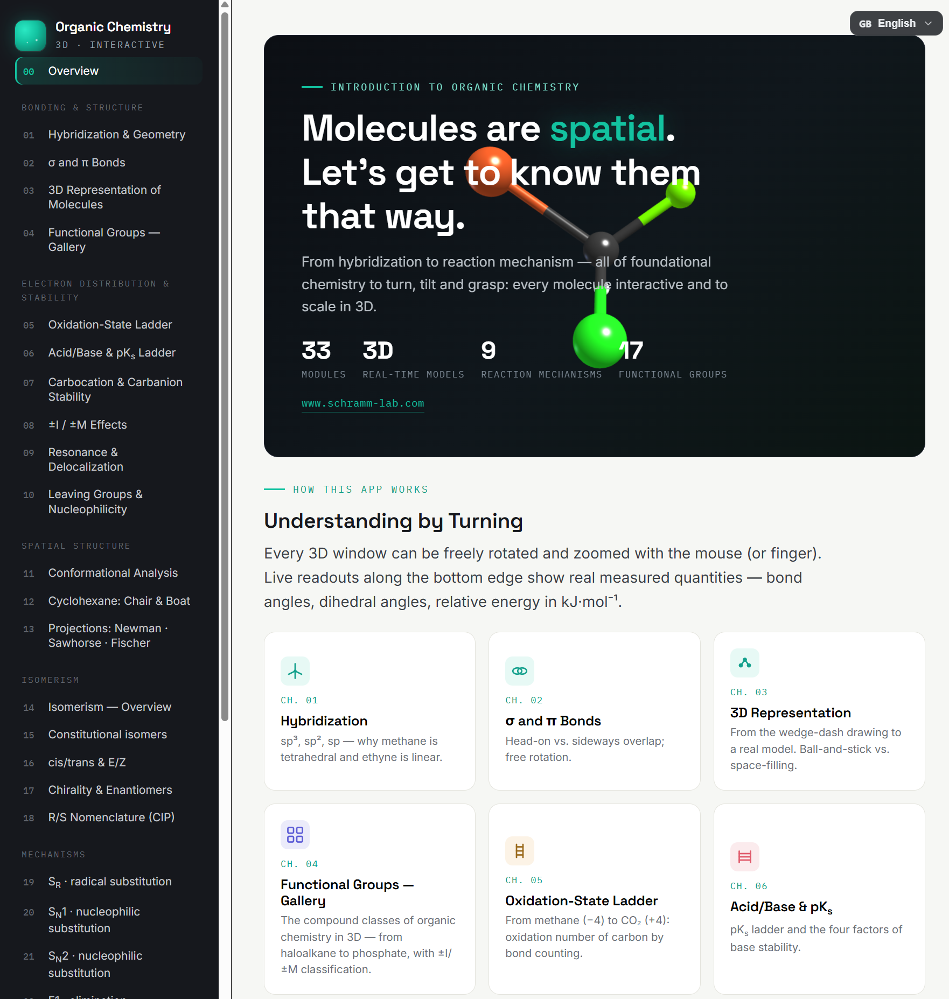
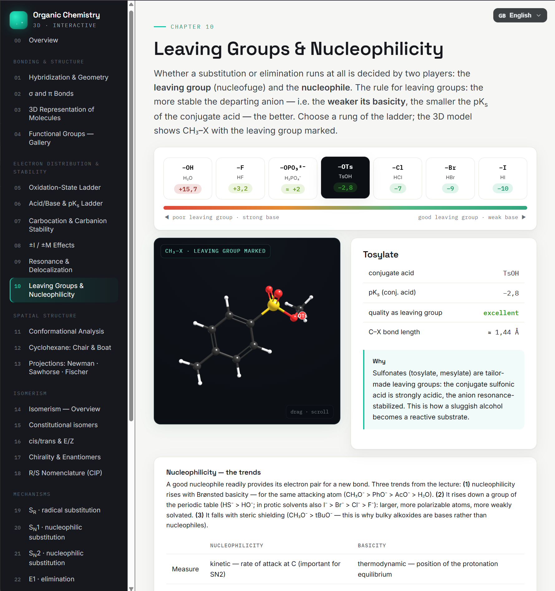
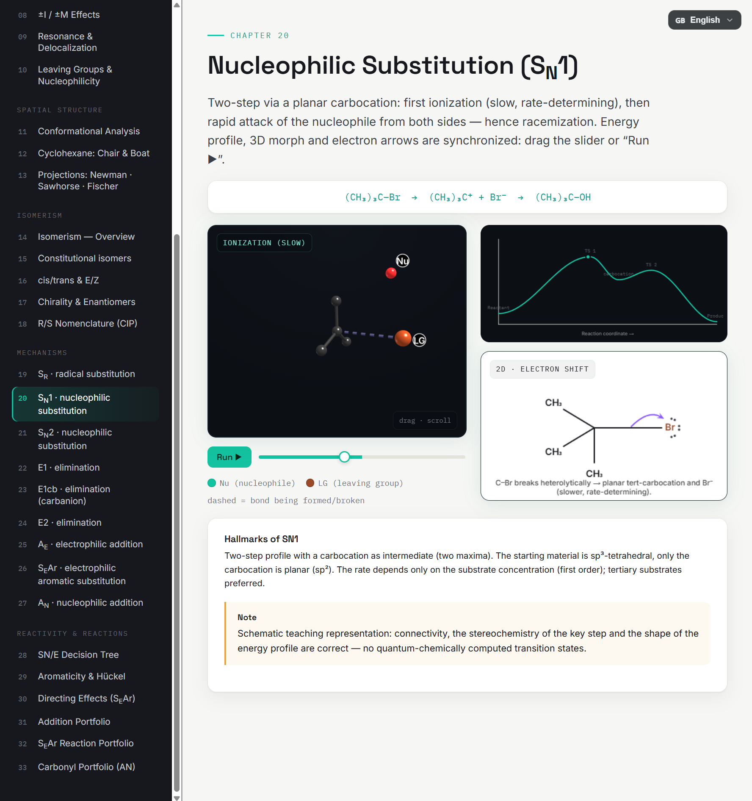
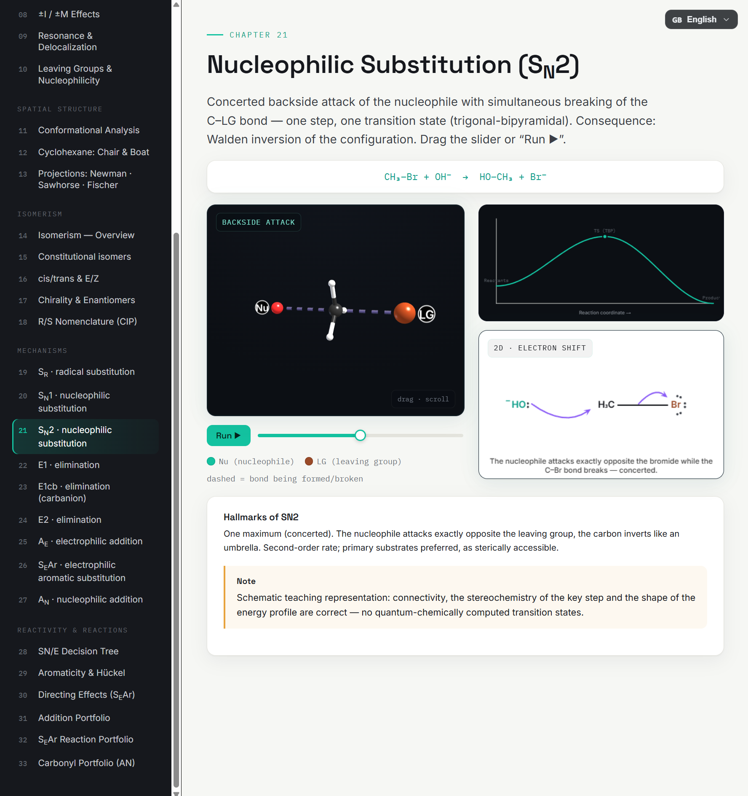

# OC3D — Organic Chemistry in Interactive 3D

**An open-source, browser-based 3D learning environment for reaction mechanisms, conformational analysis, and stereochemistry in introductory organic chemistry.**

🔗 **Live app:** https://prof-dr-stefan-schramm.github.io/OC3D/
📖 Trilingual: Deutsch · English · Français
🧪 33 didactically sequenced modules covering a full first-semester organic chemistry course

| Leaving groups & nucleophilicity | Sₙ1 mechanism | Sₙ2 mechanism |
|---|---|---|
|  |  |  |

## What is OC3D?

Molecules are three-dimensional — but lectures, textbooks, and exams are flat. OC3D closes this gap with interactive, real-time 3D models for every spatial concept of an introductory organic chemistry (OC-I) course: every molecule can be rotated, zoomed, and manipulated, with live readouts of bond angles, dihedral angles, and relative energies.

The entire application is a **single HTML file**. There is nothing to install, no account, no server, and **no tracking or data collection of any kind**. Open the file (or the live link) in any modern browser and start teaching or learning.

## Features

- **9 animated reaction mechanisms** with synchronized 3D morphing, 2D electron-pushing diagrams, and energy profiles: SR, SN1, SN2, E1, E1cb, E2, AE, SEAr, AN
- **Conformational analysis** — Newman projections with live energy curves (ethane, butane), cyclohexane ring inversion (chair/boat/twist-boat with correct energy profile), Newman/sawhorse/Fischer projections coupled to one 3D model
- **Stereochemistry** — chirality and enantiomers (synchronized mirror-image models), CIP R/S assignment computed live from 3D coordinates, cis/trans and E/Z isomerism
- **Electronic structure** — hybridization, σ/π bonds, ±I/±M effects, resonance with delocalized π clouds, carbocation/carbanion stability, pKa ladder, leaving groups and nucleophilicity
- **Reactivity** — interactive SN/E decision tree, aromaticity and Hückel's rule, directing effects, addition and carbonyl reaction portfolios
- **Guided didactic sequence** aligned with a complete OC-I curriculum, with mnemonics, cautions, and comparison tables
- **Trilingual interface** (German, English, French) with instant language switching

## Getting started

**Option A — use the hosted version:** open the live link above. Works on desktop, tablet, and phone.

**Option B — run it locally:** download `index.html` and open it in any modern browser (Chrome, Firefox, Edge, Safari). Note: the current build loads the Three.js library and web fonts from public CDNs, so an internet connection is required when the page first loads.

**For instructors:** OC3D is designed for live lecture demonstrations (project a module while explaining), student self-study, and exercise preparation. The module order follows a typical first-semester course; each module is self-contained and can be used independently.

## Technical overview

- Single self-contained HTML file (~6,000 lines) with embedded CSS, JavaScript, module data, and translation dictionaries
- 3D rendering: [Three.js](https://threejs.org/) r128 (WebGL)
- Molecular models built to scale from standard bond lengths (C–H 1.09, C–C 1.54, C=C 1.34, C≡C 1.20 Å); energies and geometries follow accepted literature values; CPK color code
- Mechanism animations are schematic teaching representations: connectivity, stereochemistry of key steps, and the shape of energy profiles are correct; they are not quantum-chemically computed trajectories (this is stated in the app itself)
- Internationalization via a German-keyed dictionary architecture — see [`docs/TRANSLATION.md`](docs/TRANSLATION.md)

## Development methodology

OC3D was developed through an expert-directed, AI-assisted process: all chemical content, pedagogical structure, and design decisions were specified, reviewed, and verified by the author, while the implementation code was generated iteratively with the large language model Claude (Anthropic). Every build passed an automated validation pipeline (syntax, structural, geometric, translation-parity, and regression tests) before release. Details in [`docs/DEVELOPMENT.md`](docs/DEVELOPMENT.md).

## Contributing translations

The i18n architecture makes new languages straightforward to add — see [`docs/TRANSLATION.md`](docs/TRANSLATION.md). Contributions are welcome; translations of chemical terminology should be reviewed by a chemist familiar with the IUPAC nomenclature conventions of the target language.

## How to cite

If you use OC3D in teaching or research, please cite it via the metadata in [`CITATION.cff`](CITATION.cff) (GitHub shows a "Cite this repository" button) or via the archived release:

> Schramm, S. *OC3D — Organic Chemistry in Interactive 3D* (Version 1.0.2) [Computer software]. Zenodo. https://doi.org/10.5281/zenodo.21203168

A peer-reviewed article describing OC3D is in preparation.

## License

Released under the [MIT License](LICENSE). © 2026 Prof. Dr. Stefan Schramm, HTW Dresden — University of Applied Sciences.

## Acknowledgments

Isabelle Navizet (theoretical chemistry) provided valuable expert feedback on the 2D drawings and visualizations as well as the French translation.

## Contact

Prof. Dr. Stefan Schramm · Applied Organic Chemistry, HTW Dresden · https://www.schramm-lab.com
